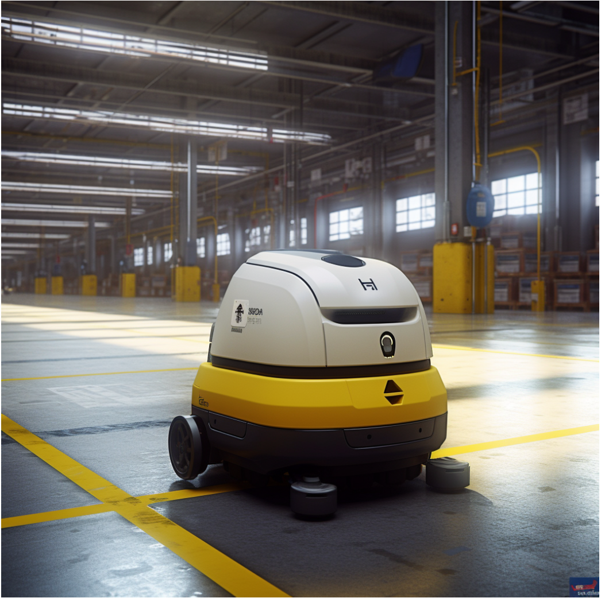

# VW Cleaning Robots

## 🚀 Getting Started

### Prerequisites

- Java 20
- Gradle 8.12

### Execution

- Compile the program by running the following command:

    `./gradlew clean build`

- Run the following command to execute the program:

    `./gradlew run --args="input.txt"`

- Run the tests with the following command:

    `./gradlew test`

## Architecture

### Domain models

- **Robot:** 
  - Encapsulates the logic of position, direction and movements.

- **Direction:**
  - Enum that represents the cardinal points. It manages the turns and displacements.

- **Workspace:**
  - Represents the workspace where the robots move.
  - Ensure that robots do not leave the allowed area with the method `assertPositionValid(position)`. This method throws an exception if the position is not valid.
  With this approach, the workspace is open to extension, allowing the addition of new rules in the future and closed to modification.

### Value Objects

- **Position:**
  - Represents the position X and Y of the robot in the workspace.
  
### Input

- The input is read from a file that contains the workspace dimensions, the initial position of the robot and the movements to be made.
- The application uses an InputProcessor an interface that decouples the way the input is processed, so it can be changed in the future to get the input from a different source (sockets, API, DB, etc.).
- The InputProcessor returns a SimulationData object that contains the workspace and the list of robots data.
In this way the application decouples the input logic from the domain logic.

#### RobotFileReader

The application has a RobotFileReader to encapsulate the logic of reading the file.

### RobotController

The RobotController is responsible for managing the input, processing and execution of the robots commands.

### Exceptions

The application has a custom exception to manage the errors that may occur during the execution of the program.

## Decisions

- The application uses a file to read the input. This allows the application to be more flexible and decouples the input logic from the domain logic.
- The application uses an interface to decouple the input logic and could change the origin of the input in the future.
- The application breaks the execution of the robots when a robot goes out of bounds or when the command received is not valid.

Author: Yodra López
